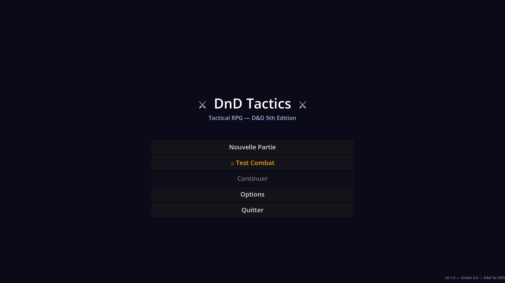
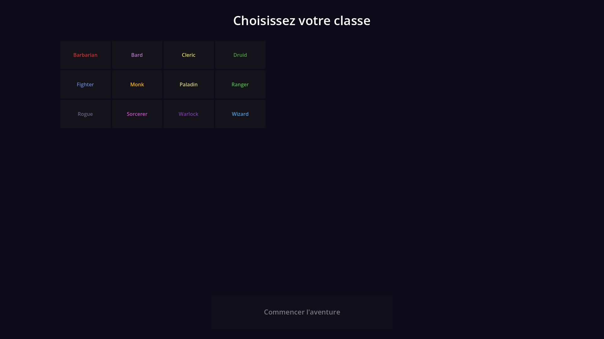
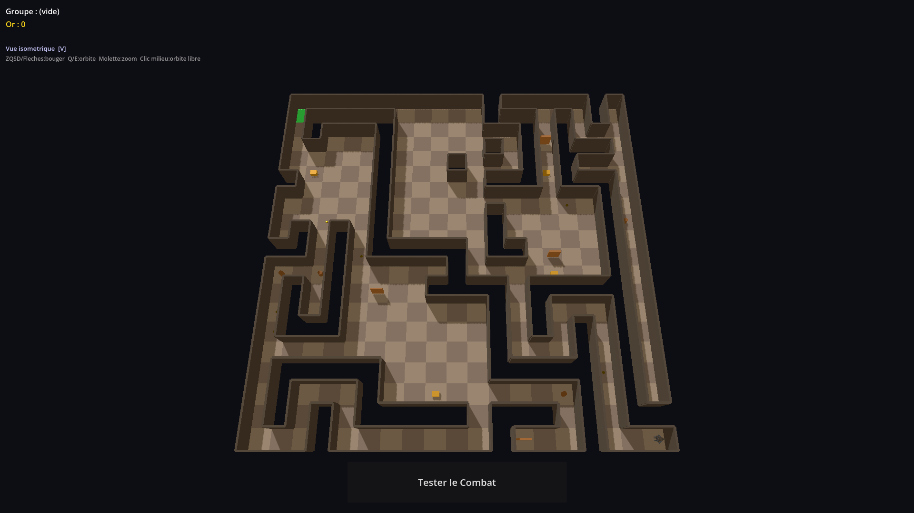
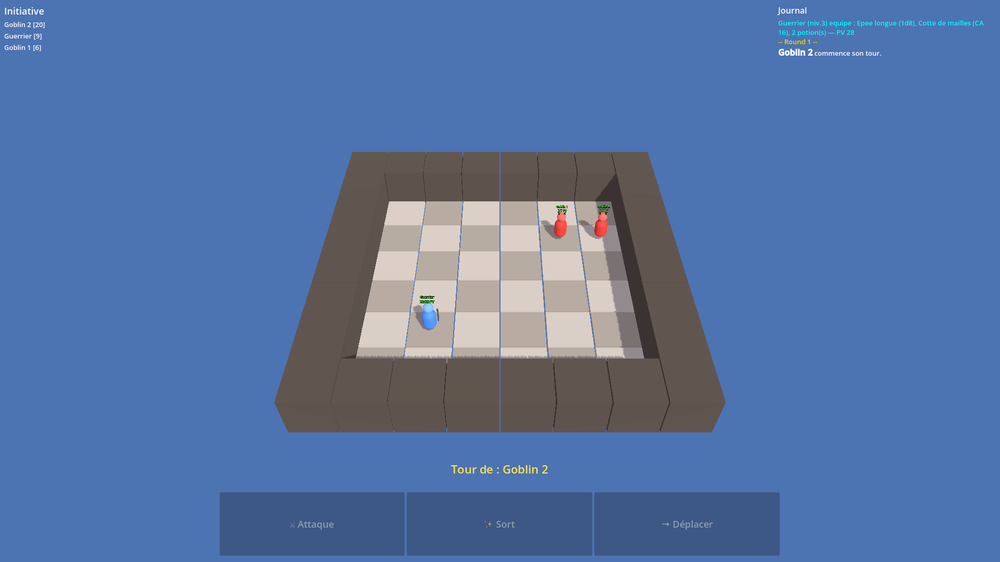

# DnD5e Godot

Prototype de tactical-RPG 3D au tour par tour sous Godot 4.6, base sur les donnees D&D 5e SRD et un moteur de combat maison (grille, initiative, actions, deplacements, IA ennemie simple).

## Etat actuel

- Menu principal + selection de classe
- Exploration de donjon procedural en 3D
- Combat tactique au tour par tour (heroes vs monstres)
- Ecran Options initial (audio, sensibilite camera, inversion X, remappage touches)
- Donnees de classes/monstres/items alimentees par dnd-5e-core

## Lancer le projet

### Avec Godot Editor

1. Ouvrir le dossier du projet.
2. Lancer la scene principale: `scenes/main_menu.tscn`.

### En ligne de commande

```bash
/Applications/Godot.app/Contents/MacOS/Godot --path . --scene scenes/main_menu.tscn
```

## Screenshots

> Les captures sont generees dans `assets/screenshots/`.

### Menu principal



### Selection de classe



### Exploration de donjon



### Combat tactique



## Commandes de jeu

### Deplacement du personnage (exploration)

- `Z` : avancer
- `S` : reculer
- `Q` : tourner a gauche
- `D` : tourner a droite
- `Fleches` : alternatives de deplacement

### Camera

- `V` : changer mode camera (iso / 3e personne / 1re personne)
- `A` : orbite camera gauche
- `E` : orbite camera droite
- `+` : zoom avant
- `-` : zoom arriere
- `Molette` : zoom
- `Clic milieu + drag` : orbite libre

### Combat

- Clic sur actions (`Attaque`, `Sort`, `Deplacer`, `Fin tour`, `Potion`)
- Clic gauche sur la grille / cible selon l'action active

## Lien avec dnd-5e-core

Le projet consomme des donnees extraites depuis `dnd-5e-core` (classes, monstres, equipements), via les scripts outils.

- Module: https://github.com/codingame-team/dnd-5e-core
- Script d'export local: `tools/dnd_data_exporter.py`
- Donnees generees: `data/classes/`, `data/monsters/`, `data/items/`

## Sources assets 3D utilises

### Models utilises dans le jeu

- `assets/models/characters/Cleric.gltf`
- `assets/models/characters/Monk.gltf`
- `assets/models/characters/Ranger.gltf`
- `assets/models/characters/Rogue.gltf`
- `assets/models/characters/Warrior.gltf`
- `assets/models/characters/Wizard.gltf`

Provenance actuelle dans l'environnement de dev: import local depuis archive `drive-download-20260413T113218Z-3-001`.

A faire avant publication publique: documenter explicitement l'auteur original, l'URL source et la licence de redistribution de ce pack.

## Structure technique

Voir `ARCHITECTURE.md` pour le detail des scenes, scripts et flux runtime.
